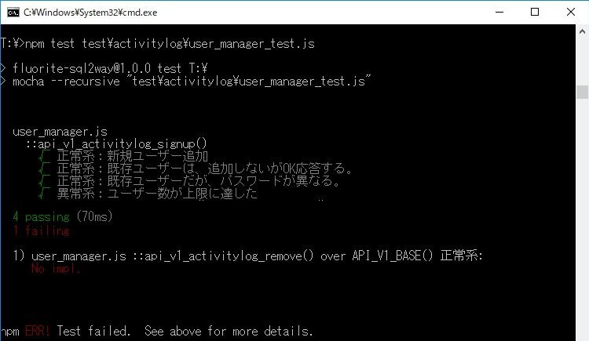
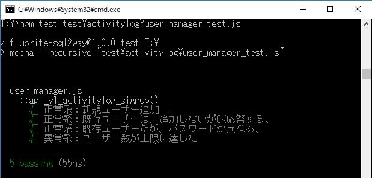
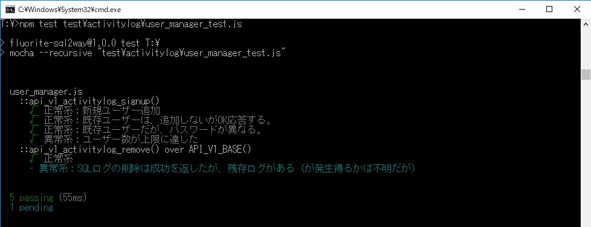

# 第１章　ライフログを記録するWebアプリケーションのサーバー側のテストを作成する

本章にサンプルコードはありません。

本章に掲載のスクリーンショットの原寸大版を掲載しておりますので、ご利用ください。

## 1.2節　Mochaとは？Chaiとは？Sinonとは？

図1.3: Mochaで「失敗」表示の例

図1.4: Mochaで「成功」表示の例

## 1.4節　ユーザー削除機能のテストを設計する（重要度に応じてPendingを利用する）

図1.5: pending表示の例

