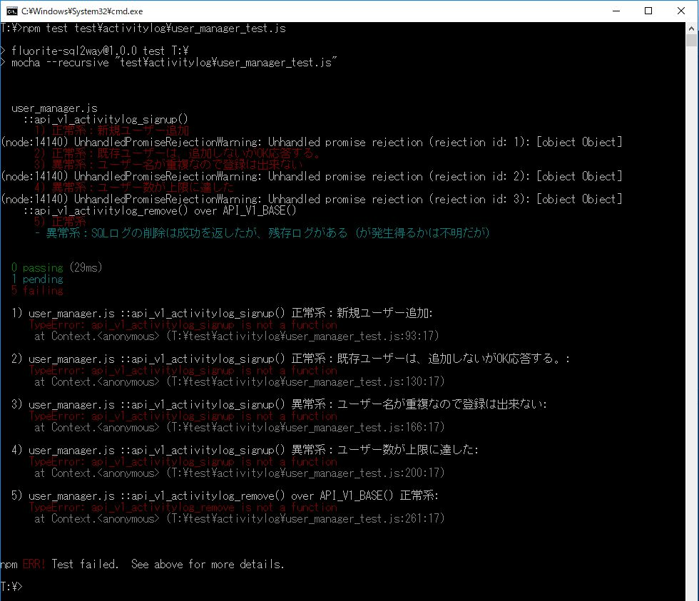

# 第2章　サーバー側の機能を実装して、テストをpass させる

本章の次の節で利用するサンプルコード「リスト2-1」が、こちらのリポジトリです。

* 2.1 フォルダ構造とアプリの構成概要について
* 2.2 テストの実⾏例と最初のテスト結果

テストの実行コマンドは以下です。

`npm test   test\activitylog\user_manager_test.js`

## 本節に掲載のスクリーンショットの原寸大

図2.1: 先ずはテストを実行してみる。被テスト対象は何も書いていない状態

