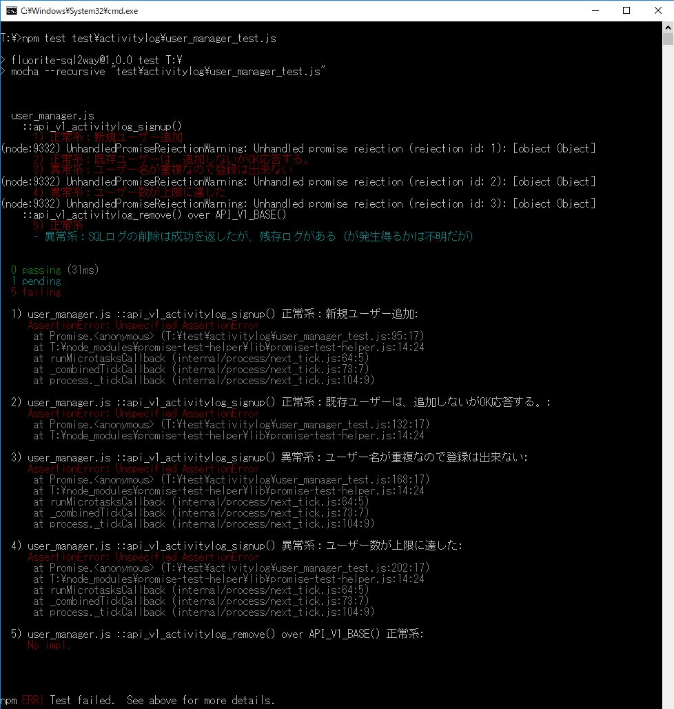
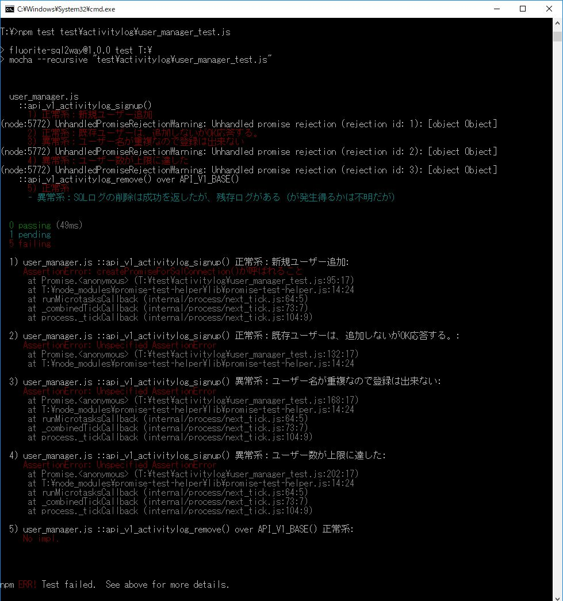
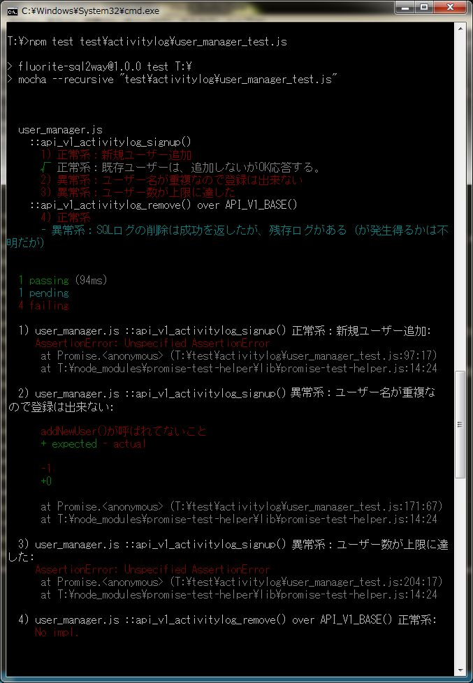
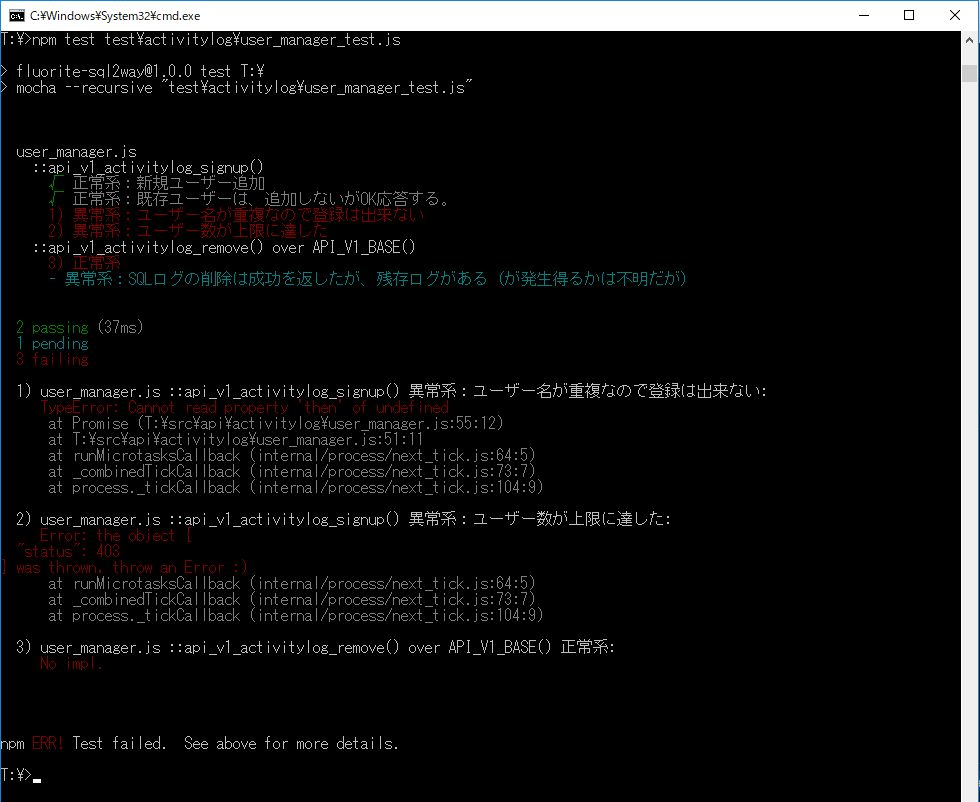

# 第2章　サーバー側の機能を実装して、テストをpass させる

本章の次の節で利用するサンプルコードのうち、前半の追加を反映したコード「リスト2-7」が、こちらのリポジトリです。

* 2.3 ユーザー登録機能を実装してテストをpassさせる

テストの実行コマンドは以下です。

`npm test   test\activitylog\user_manager_test.js`

## 本節に掲載のスクリーンショットの原寸大

図2.2: 関数の枠だけを実装した後のテスト結果

図2.3: 関数の枠だけを実装した後のテスト結果、の可読性を上げる

図2.4: api_v1_activitylog_signup()を実装してみた。その１のテスト結果

図2.5: api_v1_activitylog_signup()を実装してみた。その２のテスト結果

