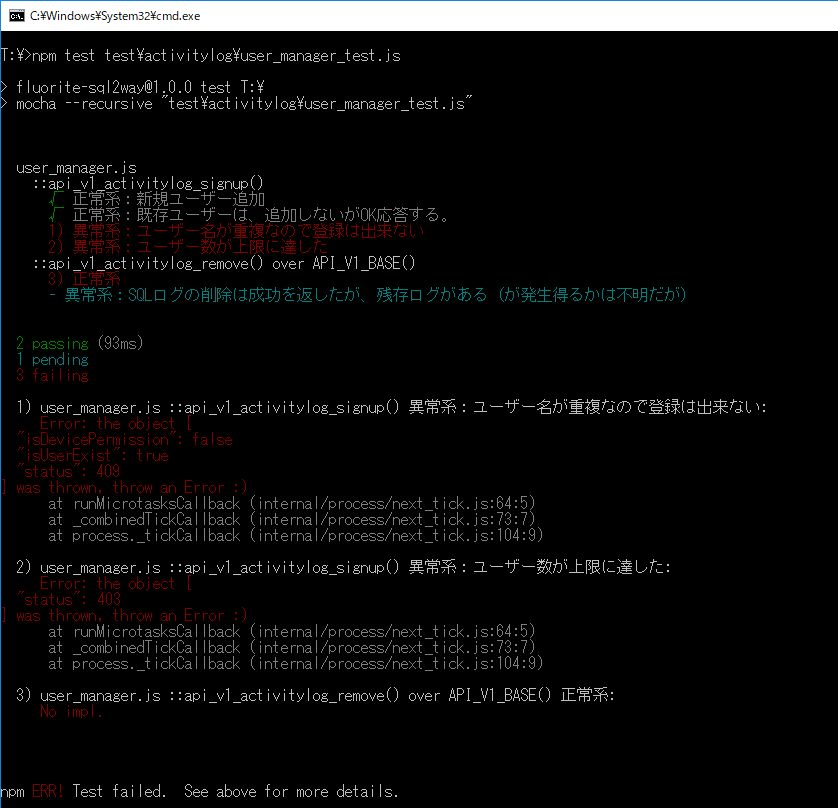
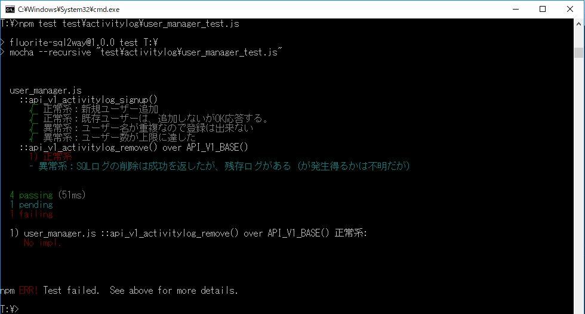

# 第2章　サーバー側の機能を実装して、テストをpass させる

本章の次の節で利用するサンプルコードのうち、後半の追加を反映したコード「リスト2-9」が、こちらのリポジトリです。

* 2.3 ユーザー登録機能を実装してテストをpassさせる

テストの実行コマンドは以下です。

`npm test   test\activitylog\user_manager_test.js`

## 本節に掲載のスクリーンショットの原寸大

図2.6: Error: the objectとして「失敗」扱い

図2.7: catch()も含めて実装後のテスト結果

