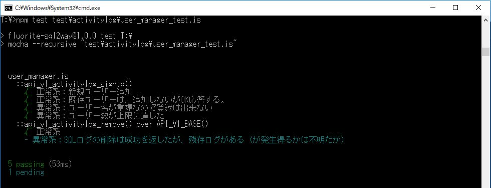

# 第2章　サーバー側の機能を実装して、テストをpass させる

本章の次の節で利用するサンプルコードの、追加分を反映したコード「リスト2-11」が、こちらのリポジトリです。

* 2.4 ユーザー削除機能を実装してテストをpassさせる

テストの実行コマンドは以下です。

`npm test   test\activitylog\user_manager_test.js`

## 本節に掲載のスクリーンショットの原寸大

図2.8: api_v1_activitylog_remove()を実装後のテスト結果

