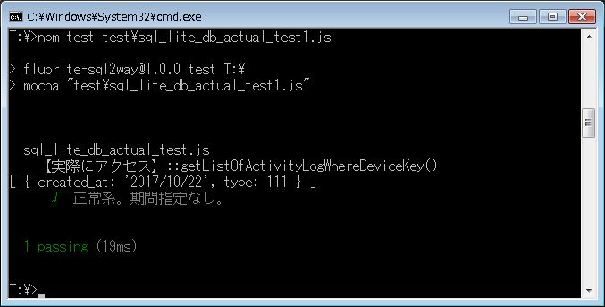

# 第３章　ライブラリのI/Oの実動作をテストで確認しながら実装する

本章の次の節で利用する、「リスト3-3」までを反映したサンプルコードが、こちらのリポジトリです。

* 3.1 テストフレームワークから実際の外部I/Oを試行する

テストの実行コマンドは以下です。実行結果は「図3.2」です。

`npm test test\sql_lite_db_actual_test1.js `

## 本節に掲載のスクリーンショットの原寸大

図3.2: テストフレームワークからSQLiteを実際にRead

## 補足

* 実際に、ログのReadを行うテストコード（紙面上で解説）
  * sql_lite_db_actual_test1.js
* 実際に、ログのWriteを行うテストコード（As Is）
  * sql_lite_db_actual_test2.js
* 実際に、ユーザーのWriteを行うが、対象のテーブルが未作成なので失敗するテストコード（As Is）
  * sql_lite_db_actual_test3.js
