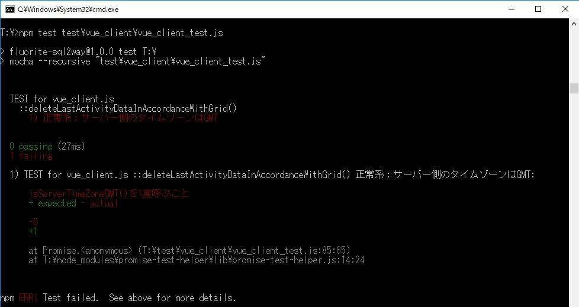

# 第４章　ライフログを記録するWebアプリのクライアント側UIを作る

本章の次の節で利用する、「リスト3-5」までを反映したサンプルコードが、こちらのリポジトリです。

* 4.1節　関数内の時間変換のテストを作成する

紙面上では記載を省略しましたが、テストの実行コマンドは以下です。

`npm test test\vue_client\vue_client_test.js`

上記のテストコマンドを実行した結果のスクリーンショットが「図4.3」になります（紙面上では次の4.2節の冒頭に掲載されています）。

## 本節に掲載のスクリーンショットの原寸大

図4.3 deleteLastActivityDataInAccordanceWithGrid() の枠だけ実装

