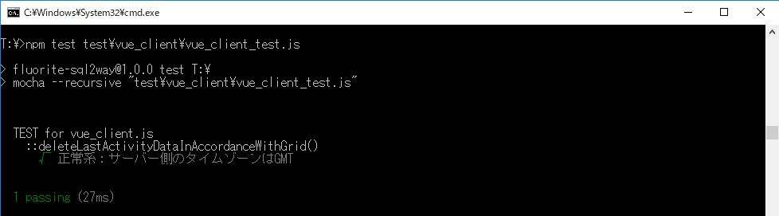

# 第４章　ライフログを記録するWebアプリのクライアント側UIを作る

本章の次の節で利用する、「リスト3-5」までを反映したサンプルコードが、こちらのリポジトリです。

* 4.2節　関数内の時間変換を実装する

紙面上では記載を省略しましたが、テストの実行コマンドは以下です。

`npm test test\vue_client\vue_client_test.js`

## 本節に掲載のスクリーンショットの原寸大

※「図4.3」は、[section4-1](../section4-1)を参照ください。

図4.4 時刻算出のテストが失敗

図4.5 時刻算出のテストが成功

## 補足

◆修正中◆

* 現在時刻についてのテストコード（紙面上で解説）
  * sql_lite_db_test2.js
* 先の節も含めて、その他のテストも記述したテストコード例（As Is）
  * sql_lite_db_test.full.js
